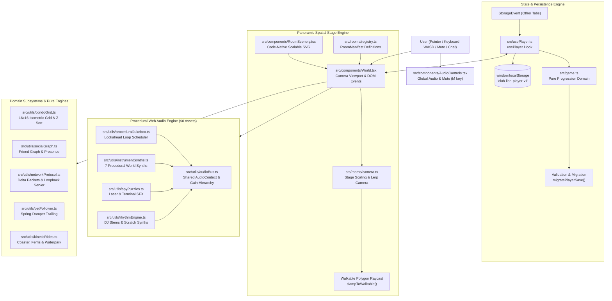

# 🏛️ Club Lion: System Architecture & Technical Specification

> **Version:** 1.0.0 (Phase 4 Master)  
> **Status:** Production-Ready  
> **Repository:** [github.com/club-lion/club-lion](https://github.com/club-lion/club-lion)  
> **Design Specifications:** [`DESIGN.md`](DESIGN.md) & [`UX-CONTRACT.md`](UX-CONTRACT.md)  
> **Multi-Agent Lifecycle:** [`docs/WORKFLOW.md`](docs/WORKFLOW.md)

---

## 1. Executive System Overview & Design Philosophy

Club Lion is a browser-based virtual world game constructed with **React 19**, **TypeScript 5.9 (Strict)**, and **Vite 8**. Inspired by the golden era of isometric and 2D virtual worlds (_Club Penguin_, _Fantage_), Club Lion is engineered under four strict non-negotiable architectural tenets:

1. **$0 Infrastructure Rule:** The entire world operates 100% locally on the client. It requires zero cloud services, zero external databases, zero paid APIs, and zero backend servers to run every feature (including avatars, pets, condos, rides, minigames, social graphs, and network protocols).
2. **Procedural Web Audio Rule:** Zero external audio files (no MP3, WAV, or OGG assets). All music tracks, ambient soundscapes, minigame audio stems, and instrument sound effects are generated procedurally at runtime using the native browser **Web Audio API** via oscillators, custom envelopes, biquad filter nodes, and noise buffers.
3. **Pure Function Separation:** All game rules, scoring logic, physics simulations, coordinate projections, network packet encoding, and save validation are written as pure functions decoupled completely from the DOM and React. This guarantees deterministic behavior and enables ultra-fast headless test suites running directly on the Node.js test runner in ~100ms.
4. **Declarative Panoramic Stages:** Rooms are not monolithic React components. They are declarative data manifests specifying stage dimensions, walkable boundary polygons, multi-layer depth sorting, spatial portal trigger zones, and interactive hot spots.

---

## 2. High-Level System Architecture

The following diagram illustrates the flow of state, user input, audio scheduling, and spatial rendering through the Club Lion client:



---

## 3. Core Domain & Progression Engine (`src/game.ts`)

`src/game.ts` is the central source of truth for all game rules, coin transactions, shop purchases, adventure quest criteria, minigame completions, and save schemas.

### 3.1 Save Format Evolution & Migration Engine

Club Lion utilizes an immutable, versioned save model. When player schemas change across phases, `migratePlayerSave()` safely transforms legacy saves into the modern schema without losing coins, items, or progress:

```typescript
export type PlayerBase = {
  name: string;
  coins: number;
  color: LionColor;
  accessory: string;
  owned: string[];
  met: string[];
  visited: PlaceId[];
  gamesPlayed: number;
  beeStopBest: number;
  pawStepsBest: number;
  fruitCatchBest: number;
  claimed: AdventureId[];
  decor: string[];
  mangoRunBest?: number;
  djBeatDropBest?: number;
  smoothiesServed?: number;
  avatarLook?: AvatarLook;
  pet?: PetState;
  starRank?: number;
  statusQuote?: string;
  stamps?: string[];
  fishCaught?: string[];
  bestFishWeight?: number;
  fashionShowBest?: number;
  spyPuzzlesSolved?: number;
  condoLayout?: string;
  friends?: string[];
  friendRequestsIncoming?: string[];
  friendRequestsOutgoing?: string[];
  recentVisitors?: string[];
};

export type PlayerV2 = PlayerBase & {
  version: 2;
  avatarLook: AvatarLook;
  pet: PetState;
  starRank: number;
  statusQuote: string;
  stamps: string[];
  fishCaught: string[];
  bestFishWeight: number;
  fashionShowBest: number;
  spyPuzzlesSolved: number;
  condoLayout: string;
  friends: string[];
  friendRequestsIncoming: string[];
  friendRequestsOutgoing: string[];
  recentVisitors: string[];
};
```

#### Migration Principles:

1. **Additive Defaults:** New features (e.g. `spyPuzzlesSolved`, `condoLayout`, `friends`) are initialized with safe defaults if missing from legacy records.
2. **Defensive Range Clamping:** Any tampered or corrupted numeric values from localStorage (e.g. negative coin balances or impossible high scores) are sanitized to legitimate upper bounds.
3. **Corrupted Save Recovery:** If JSON parsing fails or essential identity keys are missing, the engine gracefully recovers to a pristine initial player via `newPlayer()`.

### 3.2 Invariant Enforcement & Atomic Transactions

Every mutation function in `src/game.ts` is a pure function that returns a new player object:

- `buyItem(player, id)`: Validates that the item exists in `SHOP_ITEMS`, checks that `player.coins >= item.price`, verifies the player does not already own the item, and atomically deducts coins while adding to `owned`.
- `claimReward(player, adventureId)`: Strictly validates quest completion conditions (`met.length >= 3`, `gamesPlayed >= 1`, or `"den"` in `visited`) and ensures each adventure can only be claimed once.
- `unlockStamp(player, stampId)`: Cross-references `STAMP_DEFINITIONS`, verifies that requirements are met, and suppresses duplicates.

---

## 4. Panoramic World, Camera & Spatial Navigation

Club Lion stages can expand beyond standard viewports (up to 2880px wide). A virtual camera translates and clamps the viewport smoothly as the avatar navigates.

### 4.1 Coordinate Space Transformations

The spatial engine operates across three distinct coordinate spaces:

```
[Screen Space (Browser DOM Window)]
        │
        ▼ (Offset by World Container Bounding Rect)
[Viewport Space (Stage Window: 1280px × 720px)]
        │
        ▼ (Translated by Camera X & Scaled by Stage Scale)
[Logical Stage Space (Continuous 0..stageWidth × 0..stageHeight)]
```

The mathematical transformation is defined in `src/rooms/camera.ts`:

```typescript
export function pointerToStage(
  clientX: number,
  clientY: number,
  containerRect: { left: number; top: number; width: number; height: number },
  cameraX: number,
  stageScale: number,
): StagePoint {
  const relX = (clientX - containerRect.left) / stageScale;
  const relY = (clientY - containerRect.top) / stageScale;
  return {
    x: relX + cameraX,
    y: relY,
  };
}
```

### 4.2 Smooth Camera Following & Clamping

The camera follows the avatar's foot position using linear interpolation (`lerp`) with boundary clamping:
$$\Delta X = (X_{avatar} - \frac{W_{viewport}}{2}) - X_{camera}$$
$$X_{camera}(t + \Delta t) = \text{clamp}(X_{camera}(t) + \Delta X \cdot 0.12, 0, W_{stage} - W_{viewport})$$

This ensures the camera smoothly tracks player locomotion without ever exposing black borders outside the stage boundary.

### 4.3 Walkable Polygon Containment & Ray Casting

Avatars cannot walk through walls, deep water, or scenery. Rooms specify a `walkablePolygon: [number, number][]`. When a click or arrow-key step targets coordinate $(x, y)$, `clampToWalkable()` verifies polygon containment using Jordan curve ray casting:

1. Cast a horizontal ray from $(x, y)$ to $(+\infty, y)$.
2. Count intersections with polygon edges. If odd, point is inside; if even, point is outside.
3. If outside, find the nearest point on the perimeter of the walkable polygon and clamp the target coordinate to that position.

---

## 5. Declarative Room Manifest Architecture

Rather than hardcoding scenes into monolithic JSX trees, every room is defined as a declarative manifest (`src/rooms/types.ts`):

```typescript
export type RoomManifest = {
  id: PlaceId;
  name: string;
  stageWidth: number;
  stageHeight: number;
  backgroundAsset: string;
  walkablePolygon: [number, number][];
  depthLayers: DepthLayer[];
  portals: RoomPortal[];
  interactives: RoomInteractive[];
  scriptedNpcs: ScriptedNpc[];
};
```

### 5.1 The 13 Explorable Destinations

| Room ID                | Name                 | Dimensions | Unique Mechanics & Scenery                                     |
| :--------------------- | :------------------- | :--------- | :------------------------------------------------------------- |
| `square`               | Savanna Square       | 1280×720   | Central neighborhood plaza, baobab trees, scripted NPCs        |
| `water`                | The Watering Hole    | 1280×720   | Dock fishing pier (`WaterholeAngler`), marimba instrument      |
| `cafe`                 | Canopy Café          | 1280×720   | `SmoothieKitchen` minigame, piano instrument                   |
| `arcade`               | The Arcade           | 1280×720   | `MemorySafari`, `BeeStop`, `PawSteps` hub                      |
| `den`                  | Your Cozy Den        | 1280×720   | Starter player den with customizable decor items               |
| `downtown-plaza`       | Downtown Plaza       | 1920×720   | Multi-portal shopping hub, Le Shop, Stella Salon, fountain     |
| `wonder-park-entrance` | Wonder Park Entrance | 2400×720   | Roller coaster station, giant Ferris wheel, flume plunge       |
| `wonder-park-midway`   | Carnival Midway      | 2400×720   | `FruitCatch` booth, carousel, walk-on floor piano              |
| `club-pulse`           | Club Pulse           | 1920×720   | 8×6 interactive LED dance floor, `DJBeatDrop` turntable        |
| `splash-oasis-entry`   | Splash Oasis         | 2400×720   | Wave pool with kinetic physics, 1000-gal tipping dump bucket   |
| `splash-oasis-river`   | Lazy River Oasis     | 2800×720   | Continuous looped tube drift physics with companion pet        |
| `penthouse-condo`      | Luxury Penthouse     | 1920×720   | 16×16 isometric furniture grid customization, skyline scenery  |
| `secret-scout-base`    | Secret Scout HQ      | 1920×720   | Speakeasy command center, `SpyTerminal` laser & cipher puzzles |

### 5.2 Portal Latching & Safe Spawn Invariant

Portals feature automatic trigger latches. When a player transitions to a new room, their target arrival position is guaranteed to reside safely outside any exit portals within that room. This prevents infinite ping-pong room transition loops.

---

## 6. Procedural Web Audio Engine (The $0 Audio Architecture)

Club Lion rejects external static MP3 or WAV audio assets. All sound is synthesized procedurally in real time through the Web Audio API.

### 6.1 Audio Bus Architecture & Gain Topology

```
                  ┌────────────────────────┐
                  │ AudioContext (Shared)  │
                  └───────────┬────────────┘
                              │
                    ┌─────────▼────────┐
                    │ Master Gain Node │ (Global Volume & Mute M)
                    └────┬────────┬────┘
                         │        │
            ┌────────────┘        └───────────┐
            ▼                                 ▼
   ┌─────────────────┐               ┌─────────────────┐
   │ Music Gain Node │               │  SFX Gain Node  │
   └────────┬────────┘               └────────┬────────┘
            │                                 │
     ┌──────┴──────┐                 ┌────────┼────────┐
     ▼             ▼                 ▼        ▼        ▼
[Jukebox]    [DJ Beats]         [World Synths] [Spy] [Water]
```

- **Master Gain:** Controlled by the global volume slider (0–100%) and instant mute shortcut (`M` key).
- **Music Bus:** Independent toggle for background tracks and DJ loops.
- **SFX Bus:** Independent toggle for tactile interface feedback, minigame sound effects, and world instruments.

### 6.2 The Lookahead Loop Scheduler (`src/utils/proceduralJukebox.ts`)

Because `setInterval` and `requestAnimationFrame` are subject to main-thread browser jitter, the Jukebox implements a high-precision lookahead scheduler:

- The clock inspects `AudioContext.currentTime`.
- A scheduling timer fires every 25ms, queueing audio notes within a 100ms lookahead window.
- Rhythmic beats, bassline arpeggios, and synth leads maintain microsecond-accurate tempo regardless of DOM rendering activity.

### 6.3 Procedural Music Track Synthesizers

1. **Savanna Nightclub (120 BPM, 4/4):**
   - _Kick Drum:_ Sine oscillator with rapid downward exponential pitch drop (150Hz $\to$ 30Hz in 80ms).
   - _Snare:_ Filtered white noise burst mixed with 200Hz tone.
   - _Synth Bass:_ Sawtooth wave fed through low-pass biquad filter with envelope-controlled cutoff.
2. **Canopy Lo-Fi Lounge (75 BPM, 4/4):**
   - _Chords:_ Warm triangle waves tuned to 7th chords with gentle chorus detuning.
   - _Vinyl Crackle:_ Random brownian noise pops through high-pass filter.
3. **Waterhole Twilight (60 BPM, 4/4):**
   - _Pan Flute:_ Sine waves with subtle vibrato LFO and soft envelope attack.
   - _Ambient Crickets:_ High-frequency (4.5kHz) gated oscillator chirps.
4. **Carnival Calliope (140 BPM, 3/4 Waltz):**
   - _Steam Organ:_ Square wave with gentle tremolo, harmonic overtone addition, and mechanical click transients.

---

## 7. Vector Chibi Avatar, Pet Physics & Animation System

### 7.1 10-Slot Layered Paper-Doll Taxonomy

Avatars are rendered in `src/components/Avatar.tsx` as vector SVG hierarchies adhering to a universal 120×160 canvas:

```
[Layer 0] - Ground Shadow & Particle Emitters (Board Sparkles)
[Layer 1] - Hair Back (Long hair, ponytails, capes)
[Layer 2] - Body Base (Skin tones: Fair, Tan, Warm, Espresso, Bronze)
[Layer 3] - Facial Features (Anime sparkle, Wink, Sleepy, Smirk)
[Layer 4] - Footwear (High-tops, sneakers, skates)
[Layer 5] - Outfit Layer (Hoodies, jackets, denim, skirts)
[Layer 6] - Hair Front (Bangs, spikes, curls)
[Layer 7] - Headwear & Glasses (Bucket hats, beanies, shades)
[Layer 8] - Handhelds (Smoothie cup, fishing rod, sparkler)
[Layer 9] - Rideable Board (Hoverboard, skateboard, roller skates)
```

### 7.2 Pet Companion Spring-Damper Trailing Algorithm

Companion pet lions follow the player avatar via physics-based trailing in `src/utils/petFollower.ts`:
$$\vec{P}_{pet}(t + \Delta t) = \vec{P}_{pet}(t) + (\vec{P}_{target} - \vec{P}_{pet}(t)) \cdot (1 - e^{-k \cdot \Delta t})$$

- When moving, the pet enters the `trot` bounding state.
- When stationary for >1.5s, the pet transitions to `idle_sit` with gentle tail wags.
- During player emotes, the pet performs a `happy_bounce` with floating heart particles.

### 7.3 Particle Footprint Trails & Locomotion

When rideable boards are equipped:

- Avatar walking speed increases by +35%.
- Movement drops sparkling star/diamond particles into a FIFO particle queue (`src/utils/particleTrail.ts`).
- Particles decay over 600ms with scale and opacity interpolation.
- The system automatically suppresses particle emissions when `prefers-reduced-motion` is detected.

---

## 8. Isometric Condo Customization Engine (`src/utils/condoGrid.ts`)

The Penthouse Condo features an isometric room builder based on a 16×16 floor grid:

```
         (0, 0)
        /\
       /  \
      /    \
(0, 15)    (15, 0)
      \    /
       \  /
        \/
      (15, 15)
```

### 8.1 Coordinate Projection Math

Converting between Grid $(col, row)$ and Screen $(x, y)$:
$$x_{screen} = (col - row) \cdot \frac{W_{tile}}{2}$$
$$y_{screen} = (col + row) \cdot \frac{H_{tile}}{2}$$

Inverse projection (Screen to Grid):
$$col = \frac{x_{screen} / (W_{tile}/2) + y_{screen} / (H_{tile}/2)}{2}$$
$$row = \frac{y_{screen} / (H_{tile}/2) - x_{screen} / (W_{tile}/2)}{2}$$

### 8.2 Cardinal Rotations & Collision Detection

Furniture occupies an $(orientColSpan, orientRowSpan)$ footprint depending on its cardinal orientation (`N`, `E`, `S`, `W`):

- Rotations swap footprint dimensions when rotating 90°.
- `isValidPlacement()` tests all occupied grid cells against grid boundaries $[0..15]$ and checks for overlap with existing placed items.

### 8.3 Depth Sorting Invariant

To guarantee correct occlusion without 3D depth buffers, furniture items and room occupants are sorted topologically:
$$\text{Depth} = (row + col) \cdot 100 + zIndex$$
Items are rendered sequentially according to calculated depth, preventing visual clipping between overlapping sofas, jukeboxes, and den decor.

### 8.4 Compact Layout Serialization

Condo layouts serialize into a compact delimited string:

```
itemId:col:row:orientation;itemId:col:row:orientation;...
```

Example: `sofa:4:6:E;jukebox:0:0:S;bonsai:8:8:N`  
This allows room layouts to persist cleanly within the player profile and export via cloud sync backup codes.

---

## 9. Secret Scout Agency & Minigame Mechanics

### 9.1 The Secret Command Center & Spy Terminal (`src/utils/spyPuzzles.ts`)

The Secret Scout Command Center ("The Pride") features two high-stakes puzzle types:

1. **Laser Tripwire Grid:**
   - A multi-stage navigation challenge across an $8 \times 8$ grid.
   - Laser beams pulse in periodic timing cycles.
   - Players navigate their agent avatar step-by-step to the extraction portal without intersecting active beam intervals.
2. **Classified Agent Substitution Cipher:**
   - Algorithmic substitution cipher engine that encrypts savanna intelligence messages.
   - Generates random letter-mapping alphabets with validated clue hints.
   - Decryption rewards spy agency XP, progressing the player from _Recruit_ through _Commander_ with exclusive badge ribbons.

### 9.2 Complete Minigame Architecture Roster

Every minigame follows a pure-logic decoupled design pattern:

| Game                  | File Location                   | Architecture & Scoring Model                                                   |
| :-------------------- | :------------------------------ | :----------------------------------------------------------------------------- |
| **Bee Stop**          | `src/beeStop.ts`                | 10-round microsecond flower timing bar; non-linear payout curve (15–120 coins) |
| **Paw Steps**         | `src/components/PawSteps.tsx`   | Infinite-length Simon Says arrow sequence memory engine                        |
| **Fruit Catch**       | `src/components/FruitCatch.tsx` | 30-second physics drop loop with collision hitboxes and lives counter          |
| **DJ Beat Drop**      | `src/utils/rhythmEngine.ts`     | 4-channel audio stem mixer with beat quantization and combo multipliers        |
| **Smoothie Kitchen**  | `src/utils/smoothieRecipes.ts`  | Order ticket matching, conveyor belt physics, and recipe validation            |
| **Waterhole Angler**  | `src/utils/fishingEngine.ts`    | Tension gauge physics, cast power ballistics, and 8 fish species tables        |
| **Top Models Runway** | `src/utils/fashionScoring.ts`   | Theme-matching algorithm evaluating avatar wardrobe attributes                 |
| **Savanna Screamer**  | `src/utils/coasterPhysics.ts`   | Spline-based coaster train kinematics with gravity acceleration                |

---

## 10. Local-First Entity Network Protocol & Multi-Room Spatial Server

Designed to simulate an MMO environment locally while providing an immediate drop-in path for production WebSockets:

### 10.1 Compact Delta Packet Format

Remote entity states are encoded into compact primitive tuples under 40 bytes:

```typescript
export type EntityPacket = [
  entityId: string,
  x: number,
  y: number,
  heading: number,
  action: string,
  timestamp: number,
];
```

### 10.2 Spatial Room Partitioning

The `SpatialRoomServer` (`src/utils/networkProtocol.ts`) isolates network broadcast traffic by `roomId`. Avatars in `wonder-park-midway` never receive or process packet updates from `club-pulse`, keeping CPU overhead constant regardless of total world population.

### 10.3 Dead Reckoning & Linear Interpolation

To deliver 60 FPS visual smoothness from 12–15Hz network updates:

- Remote avatars interpolate position using standard lerp smoothing:
  $$x(t) = x_{prev} + (x_{target} - x_{prev}) \cdot \alpha$$
- If network packets are delayed, dead reckoning predicts subsequent position along the active velocity vector until the next authoritative packet arrives.

---

## 11. Social Graph & Guest Account System

### 11.1 Social Graph Architecture (`src/utils/socialGraph.ts`)

- **Friend Management:** Manages friendships, outgoing pending requests, and incoming invitations.
- **Roster Bounds:** Strict caps protect client storage (100 friends, 100 requests in each direction, 15 recent visitors).
- **Jump-to-Friend Travel:** Teleports the player to a friend's active room. The destination coordinates are computed dynamically via `resolveSafeSpawnPoint()`, guaranteeing the player spawns in a walkable tile outside portal zones.

### 11.2 Guest Account & Cloud Sync Engine (`src/components/AccountModal.tsx`)

- **Instant Play:** Players start instantly as a guest without signup walls.
- **Cloud Sync Backup Codes:** Player progress exports into a portable Base64-encoded backup code with timestamp and integrity verification.
- **Restore:** Pasting a valid backup code safely imports the saved state, migrating older schemas automatically.

---

## 12. Verification & Multi-Agent Quality Gate

### 12.1 Testing Pyramid

```
                ▲
               / \
              /   \
             / E2E \   tests/*.spec.ts (Playwright Chromium)
            / Tests \  Desktop (1280x720) & Mobile (390x844) + Axe AA Scans
           /─────────\
          /   Unit    \   src/**/*.test.ts (Node Built-In Runner)
         /    Tests    \  387 Pure Logic & Physics Tests (~100ms)
        /───────────────\
       / Type & Linter   \  tsc --noEmit (Strict) & Prettier 3.9
      └───────────────────┘
```

- **Unit Gate (`npm test`):** 387 unit tests running headless via Node's native test runner without DOM or browser mocks in ~100ms.
- **Integration Gate (`npm run verify`):** Runs unit tests, strict TypeScript type checking (`tsc --noEmit`), Prettier formatting check, and Vite production bundle generation in one command.
- **E2E Browser Suite (`npm run test:e2e`):** Comprehensive Playwright suite running across desktop and mobile viewports with integrated `@axe-core/playwright` accessibility audits ensuring zero WCAG AA violations.
