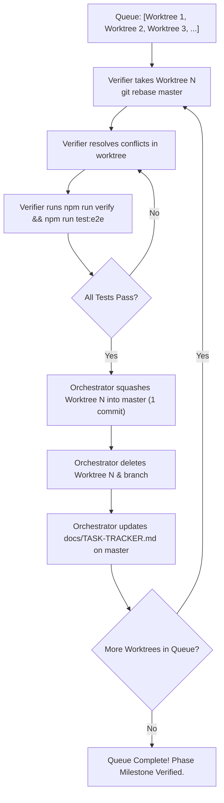

# Club Lion: Multi-Agent Development & Integration Workflow

This document defines the official multi-agent operating architecture for Club Lion. All agents (Antigravity, Codex, Claude Code, and future models) must strictly follow this protocol.

For CLI execution guides and context conservation rules, see [`docs/workflows/ORCHESTRATION.md`](workflows/ORCHESTRATION.md).

---

## 1. Role Taxonomy & Separation of Concerns

There are no rigid or permanently locked model assignments—any capable model (`gemini-3.8-flash`, `gpt-6.1-sol`, `claude-sonnet-5`) can assume any role. However, the **separation of responsibilities across the lifecycle of a task** must always be maintained:

```
[Orchestrator] (Phase Level)
      │
      ├──> Assigns task & creates isolated worktree with PROMPT.md
      │
[Implementer] (Task Level)
      │
      ├──> Develops with TDD in worktree -> commits with Implementer trailer
      │
[Reviewer] (Task Level)
      │
      ├──> Reviews diff & quality
      │    ├── Minor: fixes directly in worktree & commits
      │    └── Major: writes new PROMPT.md and hands back to Implementer
      │
[Verifier] (Integration / Worktree Level)
      │
      ├──> Rebases candidate worktree onto latest master
      ├──> Resolves all merge conflicts (e.g. package.json, shared types, CSS)
      └──> Runs verification gate (npm run verify && npm run test:e2e)
      │
[Orchestrator] (Final Integration)
      │
      ├──> Squashes worktree commits into ONE Conventional Commit on master
      ├──> Deletes worktree and pruned branch
      ├──> Updates docs/TASK-TRACKER.md on master
      └──> Designates next worktree in the queue for the Verifier -> Repeat!
```

---

## 2. Detailed Role Protocols

### Role 1: Orchestrator (Phase Level)
*The Orchestrator governs roadmap execution, worktree dispatch, integration order, and git master integrity.*

1. **Task Breakdown & Dispatch**:
   - Creates an isolated worktree for the task:
     ```bash
     git worktree add .worktrees/<task-name> -b feat/<task-name>
     ln -s ../../node_modules .worktrees/<task-name>/node_modules
     ln -s AGENTS.md .worktrees/<task-name>/CLAUDE.md
     ```
   - Writes a self-contained, uncommitted `PROMPT.md` inside the worktree with acceptance criteria, files to touch, and TDD instructions.
   - Updates `docs/TASK-TRACKER.md` on `master` to mark the task as in-progress.
2. **Merge Train Management**:
   - Maintains the queue of completed worktrees to be merged into `master`.
   - Signals the **Verifier** which worktree is next in line.
3. **Squash Integration & Cleanup**:
   - Once the Verifier confirms the worktree is rebased, conflict-free, and verified:
     - Merges and squashes the worktree into `master` as a single Conventional Commit.
     - Removes the worktree: `git worktree remove --force .worktrees/<task-name>`.
     - Deletes the feature branch: `git branch -d feat/<task-name>`.
     - Updates `docs/TASK-TRACKER.md` on `master` with completion status and commit hash.
     - Pushes `master` to remote: `git push origin master`.
   - Directs the Verifier to process the next worktree in the queue.

---

### Role 2: Implementer (Task Level)
*The Implementer operates strictly inside its assigned isolated worktree.*

1. **Isolation**:
   - Works only within `.worktrees/<task-name>`. Never touches `master` or other worktrees.
2. **Test-Driven Development (TDD)**:
   - Writes failing unit tests first (RED).
   - Implements minimal, clean production code until tests pass (GREEN).
3. **Completion**:
   - Deletes `PROMPT.md` before committing (`rm PROMPT.md`).
   - Runs `npm test` (~100ms) to ensure tests pass. (Do not run full `npm run verify` or build; that belongs to the merge gate).
   - Commits with the mandatory trailer:
     ```text
     <type>(<scope>): <summary>

     Implementer: <model> (<agent>)
     ```
   - Hands the worktree off to the **Reviewer**.

---

### Role 3: Reviewer (Task Level)
*The Reviewer acts as the quality and architecture gatekeeper inside the worktree.*

1. **Inspection**:
   - Audits git diff against:
     - Phase plan and acceptance criteria.
     - Visual guidelines in `DESIGN.md`.
     - Interaction contracts in `UX-CONTRACT.md`.
     - Architecture constraints: $0 Web Audio procedural synthesis (zero external MP3 assets), offline localStorage, strict TypeScript.
2. **Dual-Agency Action**:
   - **Minor fixes / nits** (styling tweaks, missing type annotation, test edge case):
     The Reviewer uses its judgment to make changes directly in the worktree, verifies with `npm test`, and commits with its own `Implementer:` or `Reviewer:` trailer.
   - **Major architectural flaws or missing requirements**:
     The Reviewer writes a structured `PROMPT.md` in the worktree detailing what needs fixing, and hands it back to the Implementer.
3. **Sign-off**:
   - Once satisfied, marks the worktree as approved for integration and notifies the Orchestrator / Verifier.

---

### Role 4: Verifier (Integration Level)
*The Verifier prepares candidate worktrees for merge without risking `master` stability.*

1. **Rebase against Latest Master**:
   - When designated by the Orchestrator as next in queue, rebases the candidate branch onto the latest `master`:
     ```bash
     cd .worktrees/<task-name>
     git fetch origin master  # or rebase local master
     git rebase master
     ```
2. **Conflict Resolution**:
   - Resolves any merge conflicts directly inside the worktree (e.g. `package.json` test script lines, shared types, shared CSS classes, `src/game.ts` save fields).
   - Ensures no functional regressions or dropped code.
3. **Verification Gate**:
   - Runs the full verification suite in the rebased worktree:
     ```bash
     npm run verify
     npm run test:e2e
     ```
   - All tests must pass 100% with zero TypeScript errors and clean Prettier formatting.
4. **Handoff**:
   - Informs the Orchestrator that the worktree is green, rebased, and ready for squash merge.

---

## 3. Serial Merge Train Cycle

To prevent integration race conditions when multiple agents work in parallel, merging to `master` always follows this deterministic cycle:



---

## 4. Mandatory Commit Attribution Standards

### Standard Worktree Commits (Implementer & Reviewer)
```text
<type>(<scope>): <summary>

Implementer: <model> (<agent>)
```

### Squashed Integration Commits on `master` (Orchestrator)
When squashing a verified worktree into `master`, include the complete multi-agent attribution block:

```text
<type>(<scope>): <summary>

<bulleted list of feature capabilities, changes, and test additions>

Implementer: <model> (<agent>)
Reviewer: <model> (<agent>)
Verifier: <model> (<agent>)
Assigner: <model> (<agent>)
```

*Recognized model strings:*
- `gpt-6.1-sol (codex)`
- `claude-sonnet-5 (claude code)`
- `gemini-3.8-flash (antigravity)`
